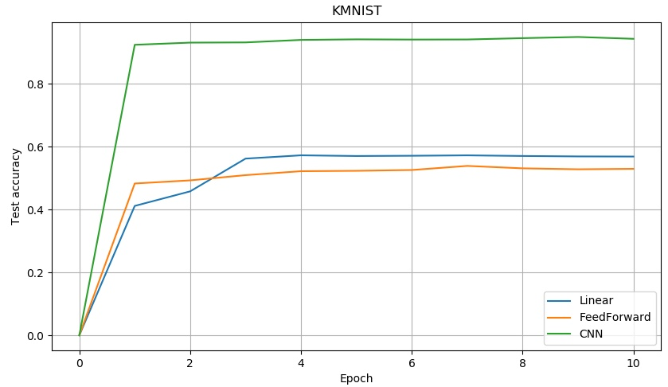
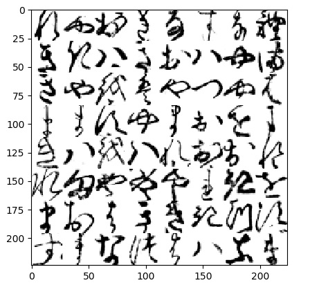

# Recognizing handwritten Hiragana symbols
## Assignment for *"Neural Networks and Deep Learning"* class at UNSW
### Received mark: 16/16

Here I will be implementing networks to recognize handwritten Hiragana symbols. The dataset to be used is Kuzushiji-MNIST or KMNIST for short. The paper describing the dataset is available here: https://arxiv.org/pdf/1812.01718.pdf. In short: significant changes occurred to the language when Japan reformed their education system in 1868, and the majority of Japanese today cannot read texts published over 150 years ago. This paper presents a dataset of handwritten, labeled examples of this old-style script (Kuzushiji). Along with this dataset, however, they also provide a much simpler one, containing 10 Hiragana characters with 7000 samples per class. This is the dataset I will be using.

  

Text from 1772 (left) compared to 1900 showing the standardization of written Japanese.

When run, part3.py will train three models, a Linear Network, Feed Forward network, and a Convolutional Network, for 10 epochs each. A full run of part3.py can take up to an hour.

A correct run over all epochs should produce the following plot:

  

Output plot for Part 3. On this dataset, learning occurs very fast, with a large amount occurring in one epoch. The increasing capacity and corresponding performance of each network type is clearly visible.

**Contraints**:  

* Do not use torch.nn.Sequential, instead use torch.nn.functional to setup your network. An example of a linear net is present.
* In this assignment, all code will run on a CPU, regardless of which version of pytorch is installed. You may set code to run on a GPU during development if you wish to speed up training (although this wont make a big difference for this assignment), but ensure you do not have .cuda() or .to() calls in the code you submit.
* Shuffling in the Dataloader has been set to off for testing purposes - in practice this would be set to True. Do not modify this.
* Do not modify the training and testing code (exception: you may wish to comment out the code displaying the sample images. This code is marked with the comment # Can comment the below out during development ).
* Do not change the names of files.
* Naming: Standard convention is to name fully connected layers fc1, fc2 etc, where the number indicates depth. Similarly for convolutional layers, conv1, conv2 should be used.

**Task 1 - View Batch**  
Whenever developing deep learning models, it is absolutely critical to begin with a complete understanding of the data you are using. For this reason, implement a function that returns an 8x8 tiling of a batch of 64 images produced by one of the dataloaders, and the corresponding labels in a numpy array. Once implemented correctly, you should see he image shown below when running part3.py.

  

First batch of images from KMNIST tiled in 8x8 grid, produced by a correct view_batch

You should also see the following printed to stdout:

[[8 7 0 1 4 2 4 8]  
&nbsp;[1 1 5 1 0 5 7 6]  
&nbsp;[1 7 9 5 7 3 7 5]  
&nbsp;[6 6 2 7 6 0 9 6]  
&nbsp;[1 5 9 5 8 0 0 8]  
&nbsp;[8 6 7 7 7 8 1 9]  
&nbsp;[6 0 5 1 1 1 3 2]  
[2 6 4 3 5 5 4 6]]  

Note that there are no part marks for a partially correct network structure. Do not assume inputs have been flattened prior to being fed into the forward pass.

**Task 2 - Loss**  
Implement a correct loss function (NNModel.lossfn). You may (and should) make calls to PyTorch here. See the comment for further information.

**Task 3 - FeedForward Network**  
Implement a feedforward network according to the specifications in the accompanying docstring.

**Task 4 - Convolutional Network**  
Implement a convolutional network according to the specifications in the accompanying docstring.
