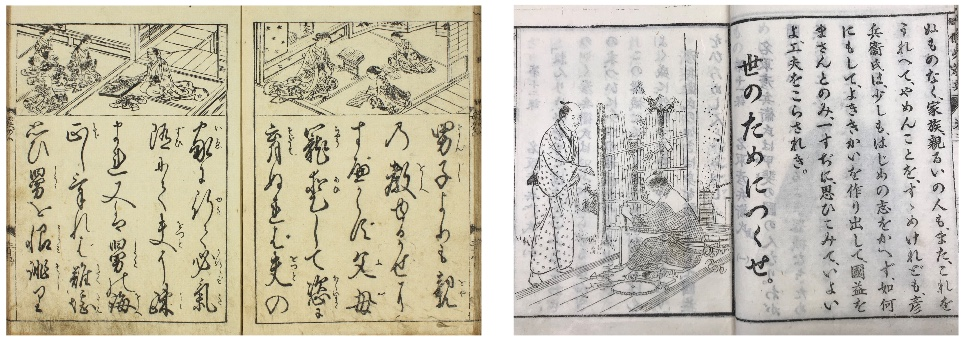

# Recognizing handwritten Hiragana symbols
## Assignment for *"Neural Networks and Deep Learning"* class at UNSW
### Received mark: 16/16

Here you will be implementing networks to recognize handwritten Hiragana symbols. The dataset to be used is Kuzushiji-MNIST or KMNIST for short. The paper describing the dataset is available here: https://arxiv.org/pdf/1812.01718.pdf. It is worth reading, but in short: significant changes occurred to the language when Japan reformed their education system in 1868, and the majority of Japanese today cannot read texts published over 150 years ago. This paper presents a dataset of handwritten, labeled examples of this old-style script (Kuzushiji). Along with this dataset, however, they also provide a much simpler one, containing 10 Hiragana characters with 7000 samples per class. This is the dataset we will be using.

  

Text from 1772 (left) compared to 1900 showing the standardization of written Japanese.

A large amount of code has been provided for you. You should spend time understanding this code. A simple model has also been provided for your reference that should make the other tasks easier. It is a good idea to use the same structure provided in this model in the code you write. The model is a linear model very similar to what you implemented in Part 1, with all inputs mapped directly to 10 ReLU activated nodes. Note that it is not identical to the model in Part 1 - do not try to reverse engineer Part 1 from this model. Technically the activation function here is redundant - however we have included it as an example of how to make use of torch.nn.functional.

When run, part3.py will train three models (one provided, two you will implement), a Linear Network, Feed Forward network, and a Convolutional Network, for 10 epochs each. A full run of part3.py can take up to an hour - however during development it is a good idea to train for fewer epochs initially, until you observe roughly correct behaviour.

A correct run over all epochs should produce the following plot:

When run, part3.py will train three models (one provided, two you will implement), a Linear Network, Feed Forward network, and a Convolutional Network, for 10 epochs each. A full run of part3.py can take up to an hour - however during development it is a good idea to train for fewer epochs initially, until you observe roughly correct behaviour.

A correct run over all epochs should produce the following plot:

  

Output plot for Part 3. On this dataset, learning occurs very fast, with a large amount occurring in one epoch. The increasing capacity and corresponding performance of each network type is clearly visible.

Contraints:  

* Do not use torch.nn.Sequential, instead use torch.nn.functional to setup your network. An example of a linear net is present.
* In this assignment, all code will run on a CPU, regardless of which version of pytorch is installed. You may set code to run on a GPU during development if you wish to speed up training (although this wont make a big difference for this assignment), but ensure you do not have .cuda() or .to() calls in the code you submit.
* Shuffling in the Dataloader has been set to off for testing purposes - in practice this would be set to True. Do not modify this.
* Do not modify the training and testing code (exception: you may wish to comment out the code displaying the sample images. This code is marked with the comment # Can comment the below out during development ).
* Do not change the names of files.
* Naming: Standard convention is to name fully connected layers fc1, fc2 etc, where the number indicates depth. Similarly for convolutional layers, conv1, conv2 should be used.

